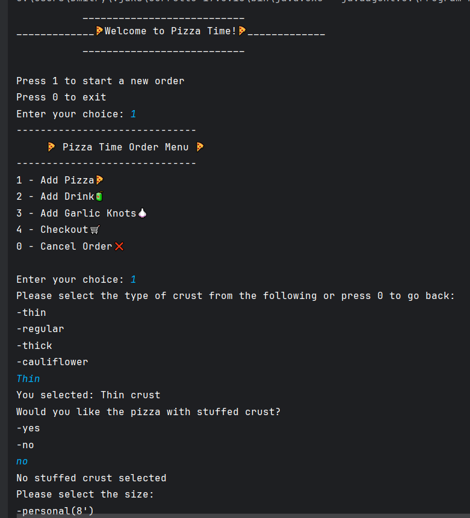
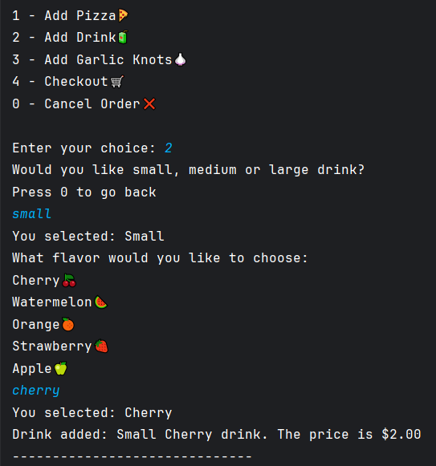
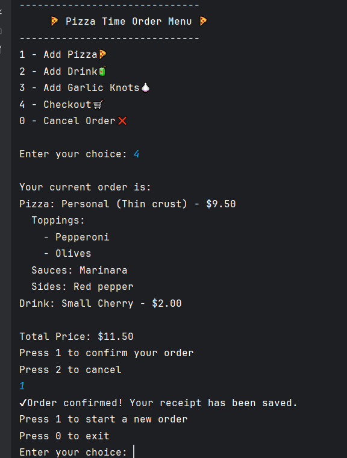

# PizzaTime
A backend point-of-sales(POS) application for a custom pizza shop.
## 🧾 Overview
**PizzaTime** is a Java-based backend service that manages pizza orders, customizations, and checkout operations for a pizza shop.
Customers can choose crusts, toppings, sauces, and more — then proceed to checkout for a detailed receipt.
## 🍴Features:
- 🍕Add pizza and customize order:
  - choose crust type
  - select size
  - add toppings, sauces and sides
- 🍹Add a drink (with size and flavor options)
- 🧄Add garlic knots
- 🛒Checkout and generate a receipt
 
***Add Pizza screen:***

***Add Drink screen:***

***Checkout screen:***

